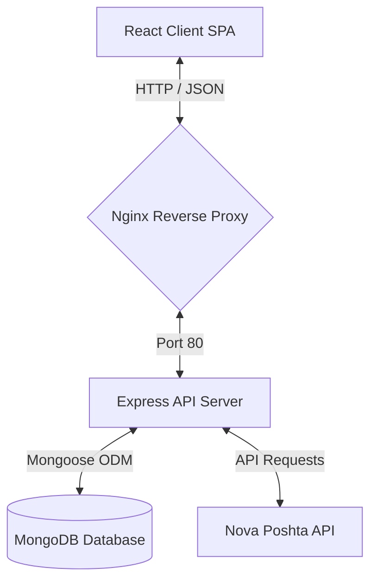

# <p align="center"></p>

<p align="center">
  
</p>

<p align="center">
  <strong>Modern Full-Stack E-Commerce Platform Built with the MERN Stack</strong>
</p>

<p align="center">
  
  
  
  
  
</p>

<p align="center">
  
  
</p>

---

## Overview

**Nexora** is a feature-rich full-stack e-commerce platform built with the MERN stack and designed to demonstrate modern web development practices. The application couples a responsive, interactive client storefront (SPA) with a multi-functional administration panel featuring sales statistics, content moderation workflows, and Nova Poshta API integration for shipping calculations.

The system is optimized for clean modularity, secure data handling, and containerized deployment across environments.

---

## Project Goals

This project was developed as a bachelor's thesis and serves as a practical implementation of a modern e-commerce platform using the MERN stack.

The primary objectives were:
* Designing a scalable client-server architecture.
* Implementing role-based access control (RBAC).
* Developing a responsive SPA interface.
* Building an administrative management system.
* Integrating external delivery services (Nova Poshta API).

---

## System Architecture

The project implements a decoupled client-server architecture with clear separation of concerns:
1. **Frontend (SPA)**: Built using React 19, communicating asynchronously with the backend via RESTful endpoints.
2. **Backend (API)**: Powered by Express.js, handling authentication, request validation, and e-commerce business logic.
3. **Database**: MongoDB with Mongoose ODM for database schemas and field validations.
4. **Proxy & Routing**: Nginx serves as the reverse proxy, routing incoming client requests to either static assets or the backend API while securing internal ports.



---

## Interface Gallery

<table align="center">
  <tr>
    <td align="center"><b>Home Page</b></td>
    <td align="center"><b>Product Catalog</b></td>
  </tr>
  <tr>
    <td><a href="public/assets/screenshots/Home Page.png"></a></td>
    <td><a href="public/assets/screenshots/Catalog Page.png"></a></td>
  </tr>
  <tr>
    <td align="center"><b>Multi-Step Checkout</b></td>
    <td align="center"><b>Admin Dashboard</b></td>
  </tr>
  <tr>
    <td><a href="public/assets/screenshots/Checkout Page.png"></a></td>
    <td><a href="public/assets/screenshots/Admin Dashboard.png"></a></td>
  </tr>
</table>

---

## Key Features

### Storefront & Customer Experience
* **Global Search**: Smart search bar in the navigation panel featuring real-time suggestions and search history.
* **Reactive Catalog Filters**: Dynamic sorting and filtering by categories, brands, price range, and custom attributes without page reloads.
* **Product Comparison**: Dedicated comparison grid to match technical specifications of up to 4 products simultaneously.
* **Custom Wishlists**: Organize saved products in multiple custom-named wishlist folders.
* **Interactive Checkout**: Automated city and branch selection synchronized directly with the official Nova Poshta shipping API.
* **Customer Dashboard**: Track order history, order delivery statuses, reviews, and questions.

### Administration & Operations
* **Analytics Dashboard**: Analytics dashboard with sales statistics and order monitoring.
* **Catalog Control**: Comprehensive CRUD management for products, brands, and categories (with template attributes inheritance).
* **Discount System**: Promo pricing support with built-in validation rules for original and discounted prices.
* **Order Lifecycle**: Workflow tracking (New, Confirmed, Packing, Ready for pickup, Received, Cancelled) with status history logs.
* **Content Moderation**: Review and approve/reject lists for product reviews and customer questions with official staff replies.
* **Audit Trail (Audit Log)**: Administrative activity log for tracking management actions.

---

## Demo Credentials

For quick evaluation of the administrative dashboard (make sure to seed the database first):

| Role | Username | Password |
| :--- | :--- | :--- |
| Admin | `admin` | `admin123` |

---

## Tech Stack

| Component | Technology | Role |
| :--- | :--- | :--- |
| **Frontend** | React 19, Vite 8, React Router DOM (v7), Context API | Single Page Application, state management |
| **Styling** | Sass (SCSS) | Modular UI layout styling |
| **Backend** | Node.js, Express.js | Stateless RESTful API Server |
| **Database** | MongoDB, Mongoose | Document Database, Object Data Modeling |
| **Proxy / Server**| Nginx | Reverse proxy, static asset hosting, SSL routing |
| **Containerization**| Docker, Docker Compose | Multi-container environment orchestration |

---

## Docker Deployment (Recommended)

To run the entire stack (Database, Backend, Frontend, Nginx) locally via Docker Compose:

```bash
docker compose up -d --build
```

Services mapping:
* **Frontend**: [http://localhost](http://localhost) (Nginx proxy, port 80)
* **Backend API**: [http://localhost:5000](http://localhost:5000)
* **MongoDB**: `localhost:27018`

To tear down the containers and network:
```bash
docker compose down
```

---

## Local Development Setup

To run client and server development servers directly on your host machine:

### 1. Install Dependencies
Install dependencies for both client and server:
```bash
npm install && cd server && npm install && cd ..
```

### 2. Set Up Environment Variables
Copy the demo configuration to the active server environment:
* **Windows (PowerShell)**:
  ```powershell
  Copy-Item .env.demo -Destination server/.env
  ```
* **Linux/macOS**:
  ```bash
  cp .env.demo server/.env
  ```

### 3. Run Development Servers
Start both dev servers concurrently:
```bash
npm run dev:full
```
The client UI will run at [http://localhost:3000](http://localhost:3000).

---

## Database Seeding & Backup

Initialize your database with pre-configured products, categories, reviews, and test users.

> [!WARNING]
> Running the database seed command wipes existing collections in the connected MongoDB target.

To seed the database:
```bash
npm run seed
```

To back up your current local database state into seed configuration files (JSON format under `server/data/`):
```bash
node server/scripts/export.js
```
